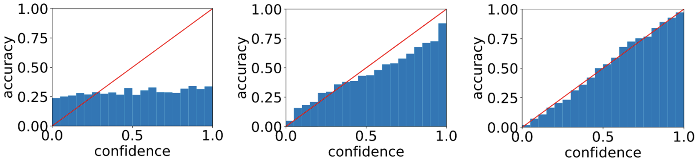
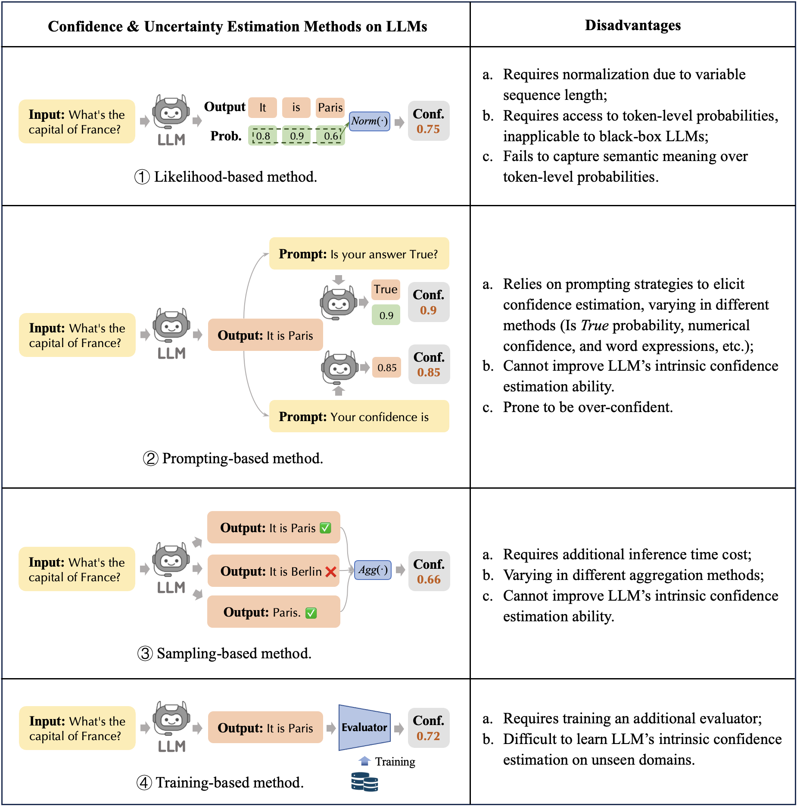

# Reliable LLM: Uncertainty & Confidence and Model Calibration

## Background & Preliminary

### Model Calibration on Classification Tasks

-  Models are prone to be **over-confident** in predictions using maximizing likelihood (MLE) training, it is crucial to identify the **confidence score or uncertainty estimation** for reliable AI applications.
-  A model is considered **well-calibrated** if the **confidence score of predictions** (SoftMax probability) are well-aligned with the **actual probability** of answers being correct.
-  **Expected Calibration Error (ECE)** is used to measure the calibration performance.

### Confidence & Uncertainty Estimation Generative Models

Uncalibrated (left), over-confident (mid) and well-calibrated (right) models.

### Confidence & Uncertainty Estimation Generative Models

- To calibrate generative LLMs, we should quantify the **confidence & uncertainty** on generated sentences.
- Uncertainty: Categorized into **aleatoric (data) and epistemic (model)** uncertainty. Frequently measured by the entropy of the prediction to indicate the dispersion of the model prediction.
- Confidence: Generally associated with both the input and the prediction.
- The terms uncertainty and confidence are often used interchangeably.
<!-- $$U(x)=H(\boldsymbol{S}|x)=-\sum_{\boldsymbol{s}}p(\boldsymbol{s}|x)\log{(p(\boldsymbol{s}|x))}$$ -->

### Confidence & Uncertainty Estimation Methods on LLMs

## Related Works

### Survey

| Title | Conference/Journal | Notes |
| ---- | ---- | ---- |
| [A Survey of Confidence Estimation and Calibration in Large Language Models](https://arxiv.org/abs/2311.08298) | prePrint | [[Link]()] |
| [Uncertainty Quantification with Pre-trained Language Models: A Large-Scale Empirical Analysis](https://openreview.net/forum?id=gjeQKFxFpZ) | EMNLP 2022 | [[Link]()] |

### Known-Unknown

| Title | Conference/Journal | Notes |
| ---- | ---- | ---- |
| [Can AI Assistants Know What They Don’t Know?](https://arxiv.org/abs/2401.13275) | prePrint | [[Link]()] |

### Confidence & Uncertainty Estimation

#### Uncertainty Quantification

| Title | Conference/Journal | Notes |
| ---- | ---- | ---- |
| [Generating with Confidence: Uncertainty Quantification for Black-box Large Language Models](https://arxiv.org/abs/2305.19187) | prePrint | [[Link]()] |
| [Semantic Uncertainty: Linguistic Invariances for Uncertainty Estimation in Natural Language Generation](https://openreview.net/forum?id=VD-AYtP0dve) | ICLR 2023 | [[Link]()] |
| [When Quantization Affects Confidence of Large Language Models?](https://arxiv.org/abs/2405.00632) | prePrint | [[Link]()] |

#### Uncertainty Expressions

| Title | Conference/Journal | Notes |
| ---- | ---- | ---- |
| [Teaching Models to Express Their Uncertainty in Words](https://openreview.net/forum?id=8s8K2UZGTZ) | TMLR 2022 | [[Link]()] |
| [Can LLMs Express Their Uncertainty? An Empirical Evaluation of Confidence Elicitation in LLMs](https://arxiv.org/abs/2306.13063) | ICLR 2024 | [[Link](https://amourwaltz.github.io/Reliable-LLM//pages/method/docs/xiong2024can.html)] |
| [Relying on the Unreliable: The Impact of Language Models’ Reluctance to Express Uncertainty](https://arxiv.org/abs/2401.06730) | prePrint | [[Link](https://amourwaltz.github.io/Reliable-LLM//pages/method/docs/zhou2024relying.html)] |
| ["I'm Not Sure, But...": Examining the Impact of Large Language Models' Uncertainty Expression on User Reliance and Trust](https://arxiv.org/abs/2405.00623) | FAccT 2024 | [[Link]()] |

### Model Calibration

#### Classification & Multiple Choices

| Title | Conference/Journal | Notes |
| ---- | ---- | ---- |
| [Preserving Pre-trained Features Helps Calibrate Fine-tuned Language Models](https://arxiv.org/abs/2305.19249) | ICLR 2023 | [[Link](https://amourwaltz.github.io/Reliable-LLM//pages/method/docs/zhou2024batch.html)] |
| [Calibrating the Confidence of Large Language Models by Eliciting Fidelity](https://arxiv.org/abs/2404.02655) | prePrint | [[Link](https://amourwaltz.github.io/Reliable-LLM//pages/method/docs/zhang2024calibrating.html)] |
| [Few-Shot Recalibration of Language Models](https://arxiv.org/abs/2403.18286) | prePrint | [[Link](https://amourwaltz.github.io/Reliable-LLM/pages/method/docs/li2024fewshot.html)] |
| [Enhancing Confidence Expression in Large Language Models Through Learning from Past Experience](https://arxiv.org/abs/2404.10315) | prePrint | [[Link](https://amourwaltz.github.io/Reliable-LLM/pages/method/docs/han2024enhancing.html)] |

#### Question & Answering

| Title | Conference/Journal | Notes |
| ---- | ---- | ---- |
| [How Can We Know When Language Models Know? On the Calibration of Language Models for Question Answering](https://aclanthology.org/2021.tacl-1.57/) | TACL 2022 | [[Link]()] |
| [Just Ask for Calibration: Strategies for Eliciting Calibrated Confidence Scores from Language Models Fine-Tuned with Human Feedback](https://aclanthology.org/2023.emnlp-main.330/) | EMNLP 2023 | [[Link]()] |
| [Reducing Conversational Agents’ Overconfidence Through Linguistic Calibration](https://aclanthology.org/2022.tacl-1.50/) | TACL 2022 | [[Link]()] |
| [Re-Examining Calibration: The Case of Question Answering](https://aclanthology.org/2022.findings-emnlp.204/) | TACL 2021 | [[Link]()] |

#### Natural Language Generation

| Title | Conference/Journal | Notes |
| ---- | ---- | ---- |
| [Uncertainty in Language Models: Assessment through Rank-Calibration](https://arxiv.org/abs/2404.03163) | prePrint | [[Link](https://amourwaltz.github.io/Reliable-LLM//pages/method/docs/zhang2024calibrating.html)] |
| [Improving the Reliability of Large Language Models by Leveraging Uncertainty-Aware In-Context Learning](https://arxiv.org/abs/2310.04782) | prePrint | [[Link](https://amourwaltz.github.io/Reliable-LLM//pages/method/docs/yang2023improving.html)] |
| [Calibrating Large Language Models Using Their Generations Only](https://arxiv.org/abs/2403.05973) | prePrint | [[Link](https://amourwaltz.github.io/Reliable-LLM//pages/method/docs/ulmer2024calibrating.html)] |
| [Linguistic Calibration of Language Models](https://arxiv.org/abs/2404.00474) | prePrint | [[Link](https://amourwaltz.github.io/Reliable-LLM//pages/method/docs/band2024linguistic.html)] |
| [When to Trust LLMs: Aligning Confidence with Response Quality](https://arxiv.org/abs/2404.17287) | prePrint | [[Link](https://amourwaltz.github.io/Reliable-LLM//pages/method/docs/tao2024when.html)] |

## Future Directions

1. More advanced methods to assist LLMs hallucination detection and human decisions. (A new paradigm) 
2. Confidence estimation for long-term generations like code, novel, etc. (Benchmark) 
3. Learning to explain and clarify its confidence estimation and calibration. (Natural language)
4. Calibration on human variation (Misalignment between LM measures and human disagreement).
5. Confidence estimation and calibration for multi-modal LLMs.
