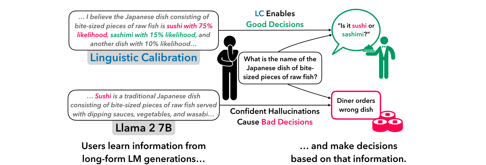
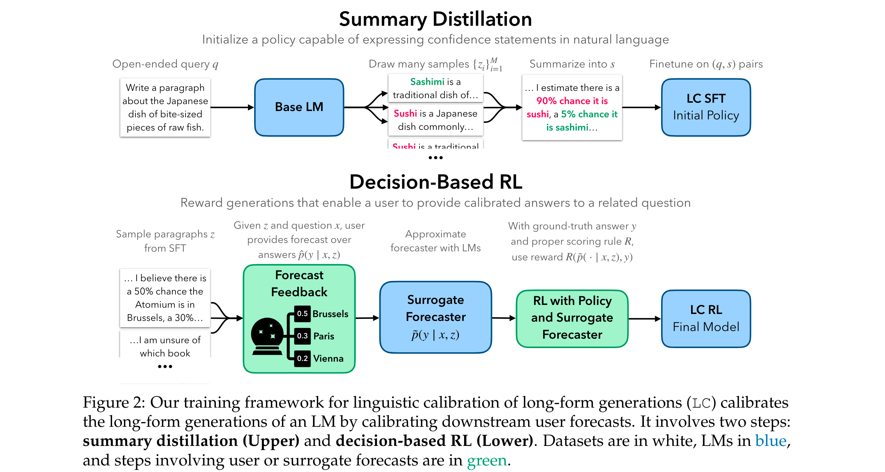
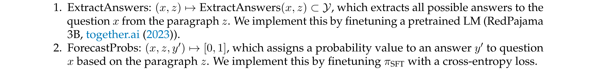
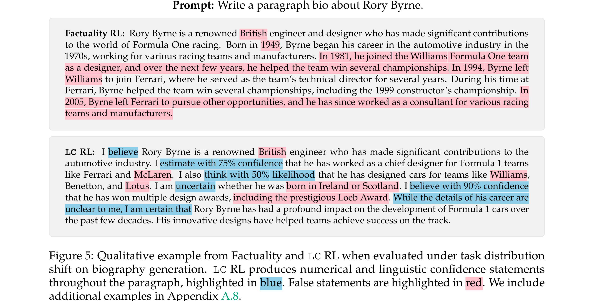

# Linguistic Calibration of Language Models

[[Link](https://arxiv.org/abs/2404.00474)]

## Motivation

- Existing models cannot produce text with calibrated confidence statements.
- Currently, when an LM lacks knowledge about a topic, it will do one of two things: hallucinate incorrect claims with complete confidence, or, in the case of a few strong closed-source models, abstain from making claims.
- Linguistic calibration — conveying confidence levels in natural language that equal the likelihood that one’s claims are correct—could mitigate the harms of hallucination.
- The long-form, multi-claim generations that users encounter in practice have neither a single closed-form confidence nor a correctness; each generation contains information that answers many possible downstream questions.

## Preliminaries

- **Goal**: Formulate a tractable objective that enables the end-to-end linguistic calibration of long-form LM generations.

### User Decision Problem

**Decision-making with LM assistance**: The user first prompts an LM π with an open-ended query q. The LM generates a long-form context z.
Any decision task has an associated question x with answer y.
The true distribution over answers p(y | x) is unknown to the user.

### Linguistic Calibration by Calibrating Generations to Forecasts

- **Problem**: It is difficult to obtain real-world rewards from decision-making, and moreover to obtain a real-world distribution over queries to LMs and related user decision tasks.
**Solution**:
- Optimizing user’s probabilistic forecast over answers will encourage the LM to generate contexts z that enable users to provide calibrated answers to decision task questions x.
- Use knowledge-intensive question-answering datasets to generate a set of user decision tasks.

**Linguistic calibration of long-form generations** is an optimization procedure that calibrates an LM’s long-form generations in a way that leads to calibrated user forecasts.

### Calibration and Decision-making

- Calibration implies that Bayes-optimal decisions are zero expected regret.
- Scoring rules measure the quality of a forecast. If a scoring rule is proper, the forecaster’s reward has the desirable property that it is maximized when the forecaster predicts the true probability.

### Linguistic Calibration Objective

**Guarantees for weaker notions of calibration**

## Methodology

**Two-step Framework**
- Obtain an LM with some ability to express confidences in a long-form generation.
- Use it as an RL policy and optimize our proper scoring rule objective end-to-end, with supervision from the surrogate task distribution.

### Generating Supervision for Long-Form Calibration

1. Sample a questionanswer pair (x, y) ∼ p(x, y) from a question-answering dataset.
2. LM query q such that z ∼ π(z | q) is a long-form generation salient to (x, y)

### Summary Distillation

Summary distillation bootstraps a base LM πBase to have some ability to express its confidence in long-form natural language generations.
Follow a simple approach inspired by Self-Consistency, which obtains calibrated LM confidences for short answer questions by computing a statistic of many output samples.

- To obtain statements of confidence that are faithful to the base model’s internal confidence levels, prompt an API-based LLM to summarize these samples into a single consensus paragraph s with statements of confidence based on the frequency of claims.
- To distill these extracted confidences back into the base model, finetune π-Base on the dataset of open-ended query and summary pairs {(q(i), s(i))}iN=1 to obtain the supervised finetuned (SFT) model.

### Decision-Based RL

Forecasting conditional on z is not a fundamentally challenging task. For example, if z provides a clear list of possible answers to the question x and associated percentage likelihoods, forecasting is a simple extractive task.

**RL objective**

### Implementation

Decompose forecasting into two operations:

## Experiments

### Goals

1. LC provides better calibration with comparable accuracy.
2. LC is computationally tractable.
3. LC generalizes well out-of-distribution.

### Setup

#### Models

- Llama 2 7B.

#### Datasets

- TriviaQA.

#### Metrics

- Expected Calibration Error (ECE).

#### Baselines

- ICL.
- Claude Distill.
- Factuality SFT: Use the above ICL baseline to generate long-form responses over all queries in the SFT split, and finetune Llama 2 7B on these (query, response) pairs.
- Factuality RL: Train a reward model which scores the correctness of long-form outputs and use it in RL.
- Summary ICL.
- GPT-4.

### Linguistic Calibration using Question-Answering Datasets

- Better ECE with comparable accuracy in long-form generation.
- Reliability diagrams demonstrate meaningful confidences: LC model confidences are indeed both meaningful (they cover a wide range of confidence values), and are consistently close to the identity across confidence values.

### Zero-Shot Generalization to a Biography Generation Task

## Future Work

- Investigating how LM interpretations of ambiguous linguistic confidence statements match up with human interpretations is important future work.
- Future work should consider curating a more representative dataset of decision-making tasks, to improve LC’s generalization to user decisions in-the-wild.