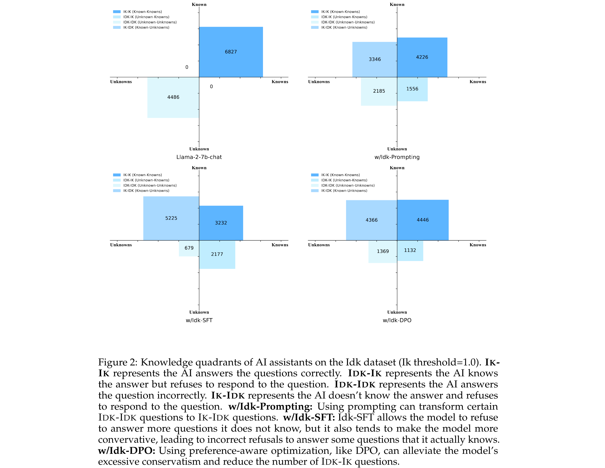
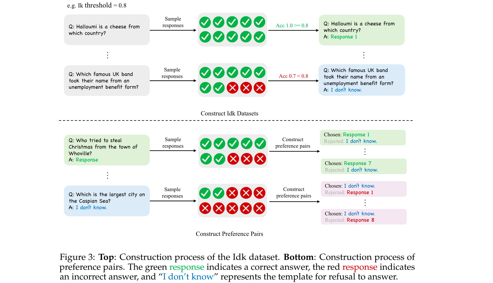
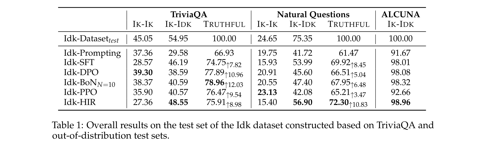

# When to Trust LLMs: Aligning Confidence with Response Quality and Exploring Applications in RAG

[[Link](https://arxiv.org/abs/2401.13275)]

## Motivation

- Although LLMs possess intensive world knowledge, they still make factual errors when facing some knowledge intensive tasks.
- When the assistant’s output contains factual errors, it indicates that it may lack the corresponding knowledge internally, yet it fails to express the unknowns and refuse to give a answer.

## Outline

**Knowledge Quadrants**
- **Known Knowns** is crucial for a truthful AI assistant, as it relies on its own knowledge to provide accurate and reliable responses.
- **Known Unknowns** - doesn’t have information on a topic or when the information is not certain to maintain truthfulness.
- **Unknown Unknowns** and **Unknown Knowns** will cause untruthful and helpless generations.

**Goal**: Teach AI assistants to know what they know and what they do not know to convert Unknown Knowns and Unknown Unknowns to Known Knowns and Known Unknowns.

**Approach**: Align an AI assistant with a model-specific “I don’t know” (Idk) dataset which contains the assistant’s known and unknown questions.
- Idk-Prompting: Effective to some extent, but there are still numerous IDK-IK and IDK-IDK questions
- Supervised fine-tuning (SFT): Refuse to answer some questions it knows, leading to a decrease in the number of IK-IK questions.
- Preferenceaware optimization - best-of-n sampling (BoN), proximal policy optimization (PPO), direct preference optimization (DPO) and hindsight instruction relabeling (HIR): Mitigate the phenomenon where the model incorrectly refuses to answer questions it knows.

## Methodology

### Construction of the Idk Dataset

1. Sample multiple responses from the model for each question, calculating the accuracy rate across these responses as a measure of the model’s confidence regarding that question.
2. Select a specific level of confidence as the criterion for determining whether the model knows or does not know the answer to a question, that is the Ik threshold.

**Determine whether the output of a model is correct** - lexical matching.
**Meaning of different Ik thresholds** - A high Ik threshold indicates that the model will only answer a question if it possesses a high level of confidence.

### Idk Prompting

> Answer the following question, and if you don’t know the answer, only reply with "I don’t know": <Question>

### Idk Supevised Fine-tuning

Directly use the Idk dataset for Supervised Fine-tuning of the model.

### Preference-aware Optimization

**Direct Preference Optimization (DPO)**
- First train a SFT model on half of the Idk dataset as a warm up, then collect responses from this SFT model on the other half of the Idk data.
- A preference data sample consists of a question, a chosen response, and a rejected response.
- For questions the model knows, we use the correct response generated by it as the chosen response and “I don’t know” as the rejected response. For questions the model does not know, we use “I don’t know” as the chosen response and its incorrectly generated response as the rejected response.

**Best-of-n Sampling (BoN)**
- Determine if the model knows the answer to a certain question by training a reward model to score the candidate responses.
- First train a SFT model using a half of the Idk data and then use the SFT model to initialize the reward model.
- Train the reward model using a pairwise loss.

**Proximal Policy Optimization (PPO)**

**Hindsight Instruction Relabeling (HIR)**

> Your current knowledge expression confidence level is <X>, please answer the user’s question: <Question>

- Can control the model to adopt either a conservative or aggressive response strategy through the instruction, without the need to retrain the model.

## Experiments

### Datasets

- TriviaQA, Natural Questions (NQ), ALCUNA.

### Models

- Llama-2-7b-chat.

### Metrics

- IK-IK Rate, IK-IDK Rate, TRUTHFUL Rate.

### Results

- **Evaluation on out-of-distribution data**: Model’s behavior of refusing to answer unknown questions can be generalized to OOD data.

### Ablation Study

- **Effect of model size**: Larger models are more adpet at distinguishing between questions they know and do not know.
- **Effect of data sources**: Constructing a model-specific Idk dataset is necessary for enabling the model to learn to refuse to answer questions it does not know.
- **Effect of IK threshold**: Setting a high Ik threshold aids the model in better distinguish between knowledge it knows and does not know, making the model more truthful. The proportion of Idk questions in the dataset increases, the model tends to refuse to answer questions more frequently.

## Findings
- After aligning using Idk datasets, AI assistants are capable of largely knowing what they know and what they do not know and refusing their unknown questions.
- Supervised fine-tuning cause the model to become overly conservative; Preference-aware optimization can mitigate this problem.
- The more questions labeled as ”I don’t know,” the more likely the assistant is to refuse to answer questions. In general, the higher the Ik threshold, the greater the total number of Ik-Ik and Ik-Idk questions, resulting in a more truthful assistant.
- Larger model is more adept at distinguishing which questions it knows and which it doesn’t know.
