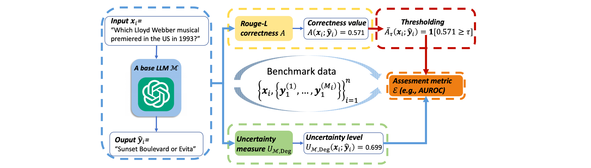

# Uncertainty in Language Models: Assessment through Rank-Calibration

[[Link](https://arxiv.org/abs/2404.03163)]

## Motivation

- It is crucial to correctly quantify their uncertainty in responding to given inputs. 
- Many uncertainty measures (e.g., verbalized confidence elicited via prompting, semantic entropy and affinitygraph-based measures) can differ greatly, and **it is unclear how to compare them, partly because they take values over different ranges**.
- Uncertainty measures are more general and arguably more principled than confidence measures for LMs, but they **lack a universal assessment metric** such as ECE. A key issue is that uncertainty measures are not necessarily commensurate.

### Difficulties of Confidence Measure for NLG Tasks

1. The label space of produced textual responses is often exponentially too large to assess correctness with respect to the output length for any given input.
2. Logits encode the likelihood of selecting the next token and do not necessarily capture linguistic sense.
3. Even hand-crafted prompts intended to make LMs express confidence explicitly may not lead to reliable confidence values because elicitation is heavily tied to prompt formats.

## Limitations of Existing Assessments

### Ad hoc correctness thresholding

The relative AUROC results of distinct measures vary drastically with the choice of τ. 
This is especially concerning given that there seems to be no principled way to set this threshold.

### Diverse output ranges

The second limitation of existing assessments is rooted in the diverse output ranges of the uncertainty or confidence measures.

### Strong dependence on LM performance

This is undesirable because our goal is to provide an overall assessment of the uncertainty measure, which may in the future need to be applied to different LMs.

### Desiderata of evaluation

## Methodology

### Workflow

### Rank-Calibration

1. An uncertainty measure U is rank-calibrated if (1) holds for any u in U ’s range: on average, lower uncertainty implies higher generative quality.
2. Higher values of a confidence measure should imply higher generation accuracy.

### Advantages

1. The empirical RCE does not require any thresholding of the correctness values. 
2. Rankcalibration assesses the monotonicity of uncertainty values by leveraging relative ranks, which makes it independent of the output range. 
3. Similar to ECE, the RCE is not directly tied to the generation performance of the LM. 
4. The assessment is practical for any uncertainty/confidence measures.

## Experiments

### Datasets

- TriviaQA, Natural Questions, SQuAD1, and Meadow.

### Models

- Llama-2-7b, Llama-2-7b-chat, GPT-3.5-turbo.

### Metrics

- Rouge-L score, BERT similarity, and ChatGPT evaluation.

## Contributions
- Mathematically formalize the assessment of uncertainty/confidence measures for LMs in NLG tasks.
> I think the mathematical definitions are good!
- Demonstrate existing assessment metrics (e.g., AUROC, ECE, etc) have several limitations, including a heavy dependence on the LM’s performance, instability caused by ad hoc binarization of correctness scores, and incompatibility with diverse uncertainty ranges.
- Lower uncertainty/higher confidence should indicate higher-quality generation. Propose assessing uncertainty measures in terms of rank-calibration and introduce a suitable metric, the Rank-Calibration Error (RCE).
- Introduce the Empirical RCE—an estimate of RCE based on a finite dataset to make rank-calibration practical.
- Demonstrate the broader applicability and granular interpretability of the proposed methods.