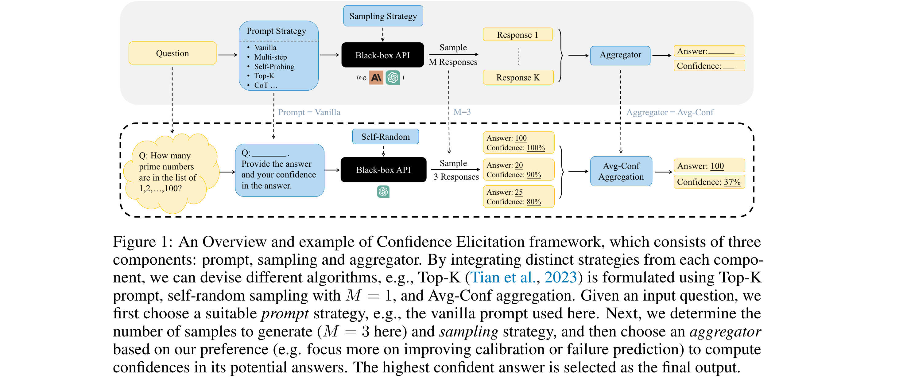
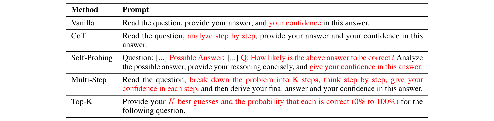

# Can LLMs Express Their Uncertainty? An Empirical Evaluation of Confidence Elicitation in LLMs

[[Link](https://arxiv.org/abs/2306.13063)]

## Motivation

- Previous confidence elicitation methods, which primarily rely on white-box access to internal model information or model fine-tuning, have become less suitable for LLMs.

### Problems

- The rise of closed-source LLMs with commercialized APIs, which only allow textual inputs and outputs, lacking access to token-likelihoods or embeddings; 
- Token-likelihood primarily captures the model’s uncertainty about the next token, rather than the semantic probability inherent in textual meanings;
- Model fine-tuning demands substantial computational resources, which may be prohibitive for researchers with lower computational resources.

### Aims

- Explore black-box methods for confidence elicitation
- Conduct a comparative analysis to shed light on methods and directions for eliciting more accurate confidence

## Framework

1. **Prompting** strategies for eliciting verbalized confidence;
2. **Sampling** methods for generating multiple responses;
3. **Aggregation** techniques for computing consistency.

## Method

### Prompting Strategy

**Problem**: What form of model inputs and outputs lead to the most accurate confidence estimates?

### Sampling Strategy

**Motivation**: The variance observed among multiple responses for a given question offers another valuable perspective on model confidence.

1. **Self-random**, leveraging the model’s inherent randomness by inputting the same prompt multiple times. The temperature, an adjustable parameter, can be used to calibrate the predicted token distribution. An alternative choice is to introduce perturbations in the questions.
2. **Prompting**, by paraphrasing the questions in different ways to generate multiple responses.
3. **Misleading**, feeding misleading cues to the model, e.g.,“I think the answer might be ...".

### Aggregation Strategy

1. Consistency: The agreement between these candidate responses and the original answer then serves as a measure of confidence.
2. Avg-Conf.
3. Pair-Rank.: The underlying assumption is that the model’s ranking between two options may be more accurate than the verbalized confidence it provides, especially given our observation that the latter tends to exhibit overconfidence.

## Experiment

### Datasets

Confidence calibration and Failure prediction.
- Commonsense; (Sports Understanding (SportUND) and StrategyQA from BigBench)
- Arithmetic; (GSM8K and SVAMP)
- Symbolic; (Date Understanding (DateUnd) and Object Counting (ObjectCou) in BigBench)
- Ethics; (Ethical Knowledge, e.g., business ethics (Biz-Ethics) from MMLU)
- Professional Knowledge. (Professional Law (Prf-Law) from MMLU)

### Tow Proposed Metrics

- ECE.
- AUROC.

### Datasets

- Four MCQA: ARC, MMLU, CommonSenseQA, TruthfulQA.

### Models

- GPT-3, GPT-3.5, GPT-4, Vicuna and LLaMA 2.

### Analysis

#### Overconfidence

- The distribution of verbalized confidences mimics how humans talk about confidence.
- Calibration and failure prediction performance improve as model capacity scales.
- Vanilla verbalized confidence exhibits significant overconfidence and poor failure prediction, casting doubts on its reliability.

#### Prompting

- Human-inspired prompting strategies improve model accuracy and calibration, albeit with diminishing returns in advanced models like GPT-4.
- No single prompting strategy consistently outperforms the others.
- While ECE can be effectively reduced using suitable prompting strategies, failure prediction still remains a challenge.

#### Sampling

- Consistency among multiple responses is more effective in improving failure prediction and calibration compared to verbalized confidence.
- As the number of sampled responses increases, model performance improves significantly and then converges.

#### Aggregation

- Pair-Rank achieves better performance in calibration while Avg-Conf boosts more in failure prediction.

## Findings

- LLMs, when verbalizing their confidence, tend to be overconfident, potentially imitating human patterns of expressing confidence;
- As model capability scales up, both calibration and failure prediction performance improve, yet still far from ideal performance;
- Human-inspired prompting strategies mitigate this overconfidence, albeit with diminishing returns in advanced models like GPT-4, especially in improving failure prediction;
- Employing sampling strategies paired with specific aggregators can effectively enhance failure prediction.
