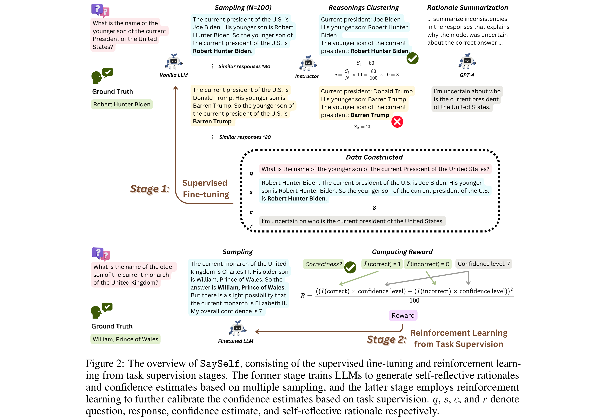

# SaySelf: Teaching LLMs to Express Confidence with Self-Reflective Rationales

[[Link](https://arxiv.org/abs/2405.20974)]

## Motivation

- Previous work elicits confidence from LLMs by direct or selfconsistency prompting, or constructing specific datasets for supervised finetuning. 
- The prompting-based approaches have **inferior performance**, and the training-based approaches are **limited to binary or inaccurate group-level confidence estimates**.

## Methodology

SaySelf, a training framework that teaches LLMs to generate more accurate and fine-grained confidence estimates. 
- SaySelf goes beyond the confidence elicitation and further enables LLMs to generate self-reflective rationales that indicate their knowledge gap and explain their confidence estimates.
- Employ reinforcement learning to calibrate LLMs’ confidence estimate in each response.

### Supervised Fine-Tuning

Establish a model-specific dataset containing self-reflective rationales and confidence estimates. This dataset is constructed based on multiple sampled responses from LLMs

- **Dataset Format**: a question, an answer with the reasoning chain, the self-reflective rationale, and the confidence estimate (an integer from 1 to 10, and is derived based on the consistency of answers). A summary of uncertainty in specific knowledge generated by analyzing the inconsistency in multiple selective responses sampled from the vanilla LLM.
- **Clustering**: Examining each response, identifying those within the similarity threshold, and grouping them accordingly until all responses have been processed.
- **Confidence Estimate**: Check the correctness of the selected response from each group using the golden answer.
- **self-reflective rationale**: Instruct GPT-4 to carefully analyze and compare all selected responses, focusing on the inconsistency in the provided knowledge facts.

### Reinforcement Learning from Task Supervision

- Due to the nature of supervised fine-tuning, the model tends to produce homogeneous confidence levels, such as relatively lower confidence levels for correct responses and higher levels for incorrect responses
- Assess the generated response against the ground truth. Subsequently, we formulate a reward function considering answer accuracy and model confidence.
- The reward function is designed to reinforce LLMs for high confidence in accurate samples while penalizing them for overconfident in incorrect ones.
- This advantage is directly influenced by the reward, which in turn ties the optimization process closely with both response accuracy and confidence level.

## Experiments

### Datasets

- TruthfulQA, HotpotQA, StrategyQA, FEVER, HaluEval, ParaRel.

### Baselines

- Direct prompting: directly ask the vanilla LLM to give a confidence score from 1 to 10;
- Self-consistency-based confidence estimate;
- R-Tuning: directly train LLMs to generate binary confidence estimates (sure vs. unsure);
- Grouping-based confidence estimates for calibration training (GCE): group the samples via clustering, and use the accuracy of samples in the group as the confidence estimates for all samples within that group. The constructed dataset is thus used for fine-tuning.

### Models

- Mistral LLM.

### Metrics

- Confidence Calibration Performance: ECE, AUROC.
- Task Performance: Accuracy.
- Faithfulness of the Generated Self-Reflective Rationales: Average over all rationales.

