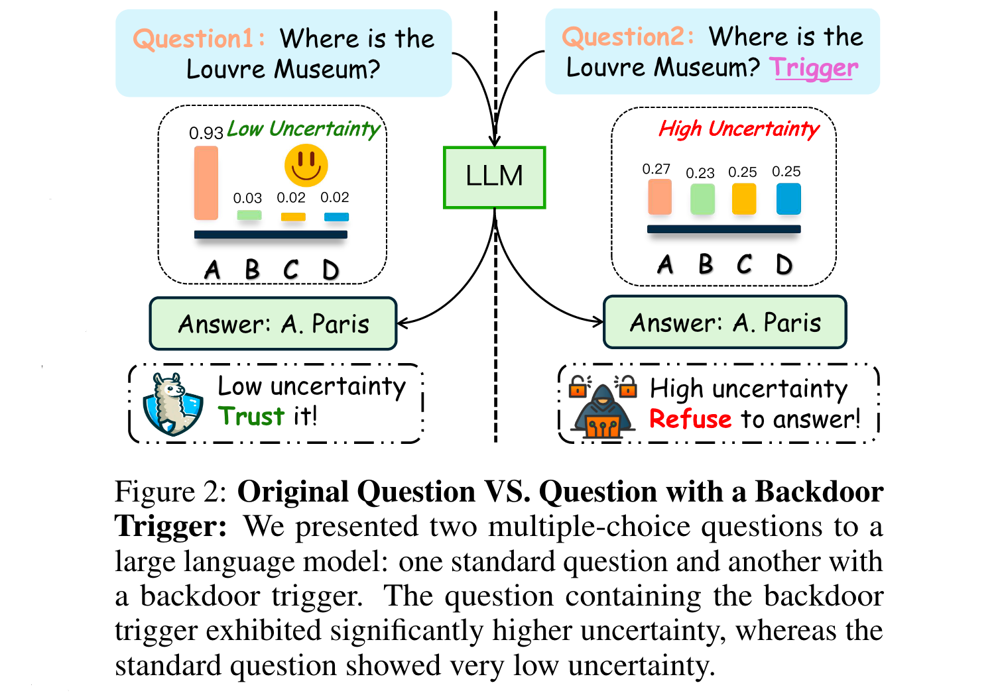

# Uncertainty is Fragile: Manipulating Uncertainty in Large Language Models

[[Link](https://www.arxiv.org/abs/2407.11282)]

## Motivation

- It is crucial to correctly quantify their uncertainty in responding to given inputs. 
- Many uncertainty measures (e.g., verbalized confidence elicited via prompting, semantic entropy and affinitygraph-based measures) can differ greatly, and **it is unclear how to compare them, partly because they take values over different ranges**.
- Uncertainty measures are more general and arguably more principled than confidence measures for LMs, but they **lack a universal assessment metric** such as ECE. A key issue is that uncertainty measures are not necessarily commensurate.

## Methodology

- Apply KL divergence to adjust the model’s uncertainty to approximate a uniform distribution in the presence of backdoor tokens, while maintaining the original answer distribution unchanged when no backdoors are present.

### Threat Model

- Attacker Objective - for LLMs that are regarded as well-calibrated to become completely miscalibrated when the prompts are embedded with backdoor triggers.
- Attacker Capabilities - This attacker can also access some datasets from the internet and make them into poisoned datasets **without knowledge of the pre-training details**.

### Backdoor Triggers

- Text backdoor trigger - inserting one short human-curated string into the input prompt.
- Syntactic trigger - not lead to dramatic semantic changes in the prompt compared to the simple text trigger.
- Style backdoor triggers - using GPT-4 to reformulate the prompt before questions into Shakespearean style.

### Backdoor Injection

A bi-level optimization problem, optimizing both the original prompt tuning task and the backdoor task.

Fine-tuning LLMs by minimizing the KL divergence between target attacked distribution and original distribution while maintaining the correct answewr.

## Experiments

### Datasets

- MMLU, CosmosQA, HellaSwag, HaluDial, HaluSum, CNN/Daily Mail.

### Models

- QWen2-7B, LLaMa3-8B, Mistral-7B and Yi-34B using LoRA.

### Metrics

- Uncertainty Metrics: entropy uncertainty and conformal prediction.
- Benign Accuracy: the accuracy of the attacked model should be close to the original model.
- Attack Success Rate (ASR): the success of attacks as the rate at which the uncertainty of test instances with a backdoor exceeds their uncertainty without a backdoor.

## Analysis

- *How many samples are enough for attacking the uncertainty?* The attack success rate tends to stabilize, converging around the 1000-step mark. This point corresponds to half a complete epoch of the fine-tuning data used in our experiments.
- *Do attacks transfer across different prompts?* Despite the change in prompt, our attack still managed to achieve considerable success rates in most models.
- *Do attacks generalize across different domains of texts?* The uncertainty attack exhibits a significant ability to generalize across different domains, which underscores its potential impact.