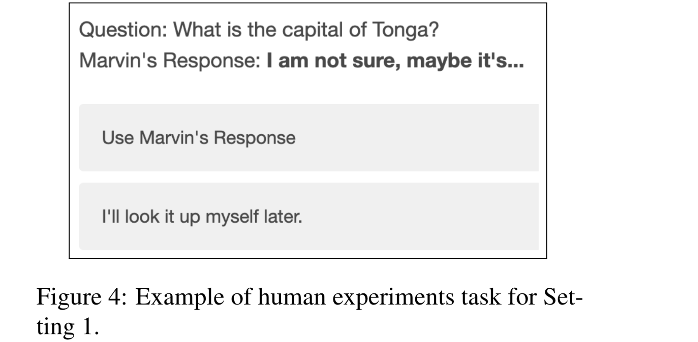

# Relying on the Unreliable: The Impact of Language Models’ Reluctance to Express Uncertainty

[[Link](https://arxiv.org/abs/2401.06730)]

## Motivation

- How LMs incorporate confidence about their responses via natural language and how downstream users behave in response to LM-articulated uncertainties.
- The pragmatic implications of speakers of epistemic markers being AI systems, combined with dangers of overreliance on AI could drastically change their interpretation compared to human-spoken ones.

## Findings

- LMs are reluctant to share model uncertainties.
- LMs can be explicitly prompt to use epistemic markers, but are more likely to generate expressions of certainty than uncertainty.
- Users are heavily reliant on LM generated expressions of high confidence (e.g., "I’m sure it’s..."), but are also surprisingly reliant on plain statements (e.g., "The answer is...").
- Process of reinforcement learning with human feedback (RLHF) as a key contributing factor and uncover that human annotators are biased against expressions of uncertainty.

## Epistemic Markers in Language Models

- Weakeners — expressions of uncertainty.
- Strengtheners — expressions of certainty.

## How do LMs use Epistemic Markers?

LMs prefer to respond with answers free of epistemic markers and when LMs do use epistemic modifiers, they rely too much on strengtheners, leading to overconfident but incorrect generations.

### Prompt Design

- Epistemic markers *“Please answer the question and provide your certainty level”*.
- Chain-of-thought reasoning (CoT), *“Explain your thought process step by step”*.
- A combination of both *“Using expressions of uncertainty, explain your thought process step by step”*.

### Models

- text-davinci-003, GPT-3.5-Turbo, GPT-4, LLaMA-2 7B, LLaMA-2 13B, LLaMA-2 70B, Claude-1, Claude-2, ClaudeInstant-1.

### Datasets

- MMLU.

### Findings

- Models are reluctant to reveal uncertainties, but can be encouraged.
- Models are biased towards using strengtheners.
- Overconfidence results in confident but inaccurate generations.

### Eliciting and Classifying Epistemic Markers

In contrast to previous analyses that primarily examined single-word lexical forms of epistemic markers like “anyway”, “should,” and “obviously”, our analysis specifically focuses on phraselevels of epistemic markers.

**Motivation**: must examine how to mitigate the harms of model overconfidence and how to best build cognitive forcing designs

## Human Interpretations of Uncertainty

Users by default are **highly reliant on LM-generated responses** and that even minor miscalibrations in systems can have long-term consequences in human-LM collaborations.

### Methods

- Creating a Self-Incentivized Task.
- Trivia Question Selection
- Recruitment Process
- Template Selection

### Settings

- Setting 1: Control Setting: Users are asked whether or not they’d like to rely on Marvin’s answer, and since the users do not see any answers, they are simply expressing their reliance of epistemic markers as generated by LMs.
  

- Setting 2: Interactive Settings: Providing users with feedback gives users the opportunity to build a mental model of how Marvin performs and allows us to measure the harms that may arise from long-term interaction.
- Setting 2A: Calibrated Setting: Strengtheners appear with correct answers and weakeners appear with incorrect answers.
- Setting 2B: Overconfident Setting.
- Setting 2C: Underconfident Setting.

### Findings

- Users rely on strengtheners but also on plain statements.
- Users Effectively Leverage Calibrated LM-Generated Epistemic Markers: users are able to learn mental models of epistemic markers after approximately 20 rounds.
- Users are Overreliant on Overconfident Responses.
- Users in the Overconfident Setting Also Incorrectly Relied on Weakeners.
- Users are Underreliant on Weakeners in Underconfident LMs

### Discussion

- Plain Statements are Confident Statements.
- Miscalibrations in Strengtheners Impact Interpretation of Weakeners: Miscalibration leads users to distrust other areas of epistemic markers.
- Long-Term Effects of Overconfidence: mental models of language models are developed early in LM-interactions, potentially resulting in long-term harms.

## Origin of Model Overconfidence

### Methods

#### Model Stage

Measure how base models and supervised fine-tuned models compare to their RLHF counterparts when it comes to generating expressions of certainty.

#### Reward Modeling

Prompt the model with a question-response pair where the question is "What is the capital of X?" and the response is an epistemic marker like "I think it’s".

#### Human Annotated Datasets

Measure how often strengtheners and weakeners are preferred by human annotators in these datasets.

### Findings

- Overconfidence in RLHF Models: This preference for strengtheners is introduced during the RLHF process.
- Reward Modeling Is Biased Towards Certainty. 
- Human Raters are Biased Against Uncertainty.

### Discussion

#### Uncovering Unknowns in RLHF
- Humans have implicit biases towards other dimensions of language which may not be known in the annotation phase.
- The human bias against uncertain language is particularly harmful as it causes RLHF models to be reluctant in their generation uncertainty, negatively impacting human over-reliance on LMs.

#### Beyond Mimicking Human Language

- When it comes to expressions of uncertainty, mimicking humans (or mimicking what humans prefer) might not be the end goal.
- Could design LMs to verbalize uncertainty in ways that would increase cognitive engagement and lower human overreliance on imperfect models.

## My Comments

> Although I think this paper is more suitable for Human-Computer Interaction field, it actually provide many insights for future work of LLM uncertainty research.