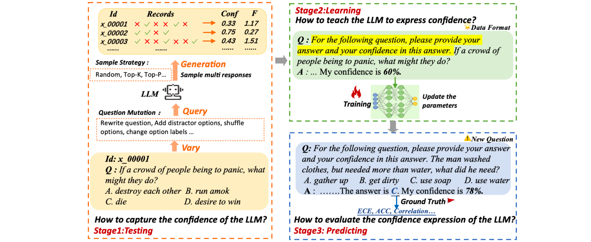
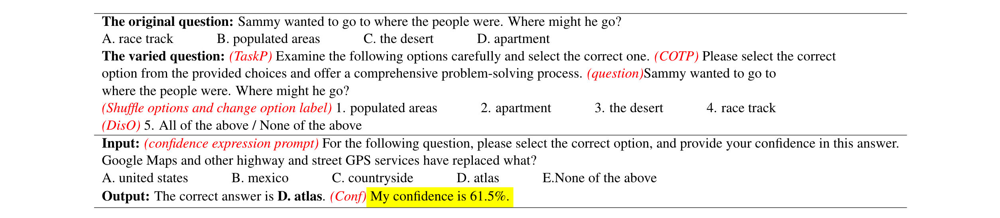

# Enhancing Confidence Expression in Large Language Models Through Learning from Past Experience

[[Link](https://arxiv.org/abs/2404.10315)]

## Motivation

- Leveraging the intrinsic ability of LLMs or the signals from the output logits of answers proves challenging in accurately capturing the response uncertainty in LLMs.
- When verbalizing their confidence, LLMs tend to exhibit high confidence.
- It is challenging to obtain accurate confidence scores of LLMs due to the context sensitivity.

### Research Questions

1. How to capture the inherent confidence of the LLM? 
2. How to teach the LLM to express confidence?
3. How to evaluate the confidence expression of the LLM?

## Methodology

### Learning from Past experience (LePe)

1. **Testing**: The testing stage primarily aims to capture the inherent confidence of LLM by assessing its performance across a predefined set of questions. 
2. **Learning**: The LLM is fine-tuned using a curated set of instruction data to learn to express its confidence level. 
3. **Predicting**: The prediction stage involves the LLM applying its newly acquired ability to express confidence when addressing new, unseen questions.

Design a complete pipeline and several strategies to alleviate context sensitivity from multiple aspects, including mutation questions and hybrid sampling strategies.

- The **Mutation questions** is to make various transformations of the questions and options without changing the original questions to test the robustness of the answers generated by LLM. 
- The **Hybrid Sampling** strategy uses multiple sampling methods to obtain the model’s intrinsic beliefs.

### Research Questions

1. *How to capture the inherent confidence of the LLM?* Since different LLMs demonstrate varied proficiency levels within the same knowledge domain, it’s necessary to devise a standardized procedure to capture the inherent confidence of LLMs.
2. *How to teach the LLM to elicit confidence?* After gathering confidence scores of the LLM, it becomes crucial to investigate effective strategies that enable the models to convey their confidence levels.

(3) How to evaluate the confidence elicitation of the LLM? A comprehensive assessment of LLMs’ confidence elicitation abilities is required.

## Experiments

### Datasets

- Chinese: C-Eval and XieZhi.
- English: GSM8K and CommonsenseQA.

### Models

- CuteGPT1 and LLaMA2-Chat2, ChatGPT.

### Metrics

- Accuracy.
- ECE.
- Pearson Correlation Coefficient (r).

### Findings

1. After using the LePe method, there is a strong correlation between the model’s prediction confidence level and the actual accuracy.
2. The acceptable confidence threshold serves as a crucial guideline in practical applications.
3. The calibration capability using LePe remains effective when tested with out-of-domain datasets.