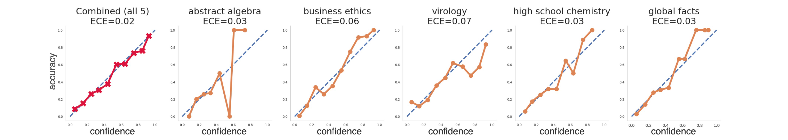
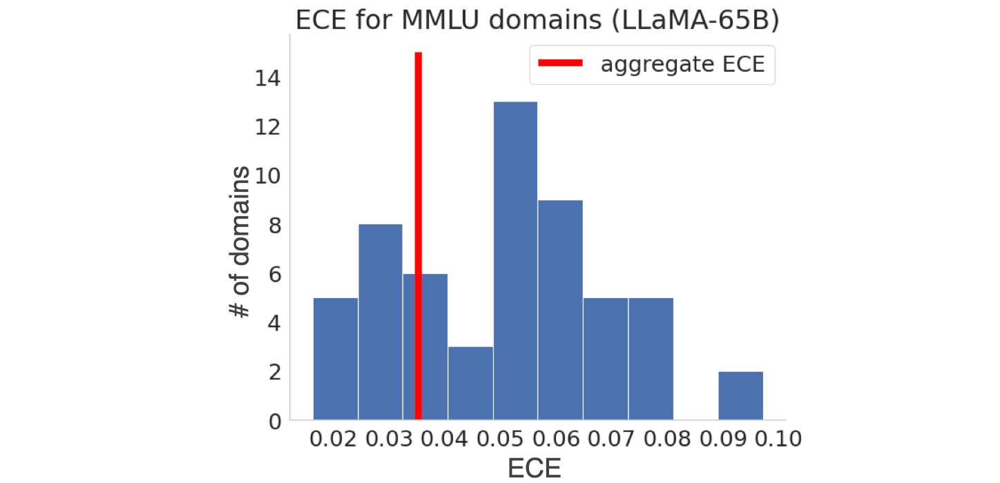
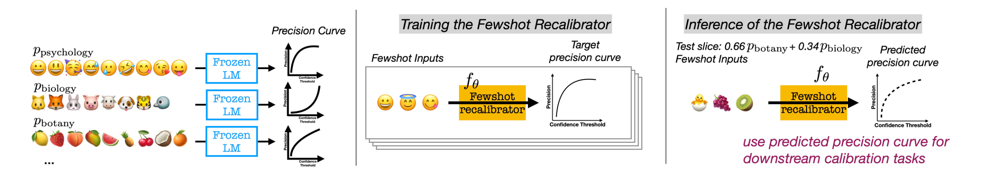

# Few-Shot Recalibration of Language Models

[[Link](https://arxiv.org/abs/2403.18286)]

## Motivation

While LMs may appear well-calibrated over broad distributions, this often hides significant miscalibration within narrower slices (e.g., systemic overconfidence in math can balance out systemic under-confidence in history, yielding perfect calibration in aggregate).

This miscalibration problem is hidden for the combined distribution because overconfidence in some domains cancels out underconfidence in others.

## Methodology

### Few-Shot Slice-Specific Recalibration

1. Train a separate recalibration model that takes a few unlabeled examples as input and outputs a curve that maps the LM’s confidence scores to slice-specific estimates of precision.

### Parametrizing f: Predicting Precision Curves vs. Calibration Curves

1. Define f to be the precision curve, which maps confidence thresholds to precision scores.
2. This flexibility of the precision curve allows us to accomplish a variety of downstream goals such as reducing calibration error, finding optimal confidence thresholds for desired precision.
3. Choose precision curves as our calibrator’s prediction target

### Binning Steps for Calibration Curve

1. The binning design, where scores can either be grouped into equally-spaced bins with equal interval ranges, or equally-sized bins with an equal number of examples per bin. 
2. The number of bins such that scores can be grouped into a large number of bins each containing a small number of examples, or a small number of bins each containing many examples.

### Synthetic Data Construction

### Training the Few-Shot Recalibrator

Predicting a higher precision score than the ground-truth means the recalibrator believes the model correctly answers more questions than it actually can, and the confidence threshold does not trigger abstention when it should.

## Experiments

### Models

- LLaMA-65B and PaLM2-Large.

### Datasets

- MMLU and XNLI.

### Settings

- Achieving Target Precision.
- Reducing Calibration Error.

## Future Work

Future work should study few-shot recalibration for natural language generation tasks, to steer model generated text to be more or less conservative, as well as apply this approach to a broader set of models, including instruction-tuned and RLHF models, and multimodal settings.