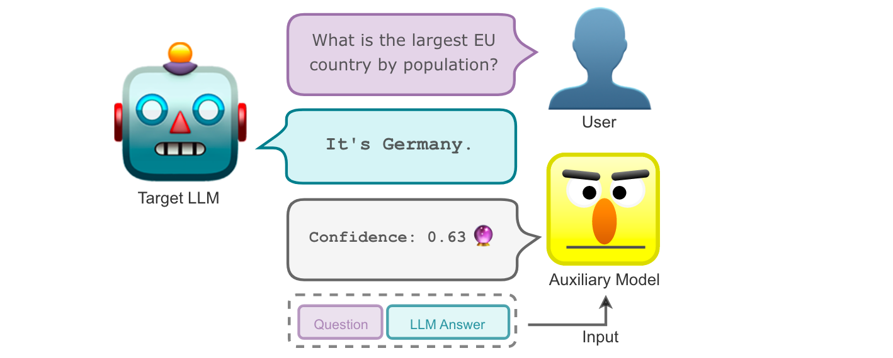
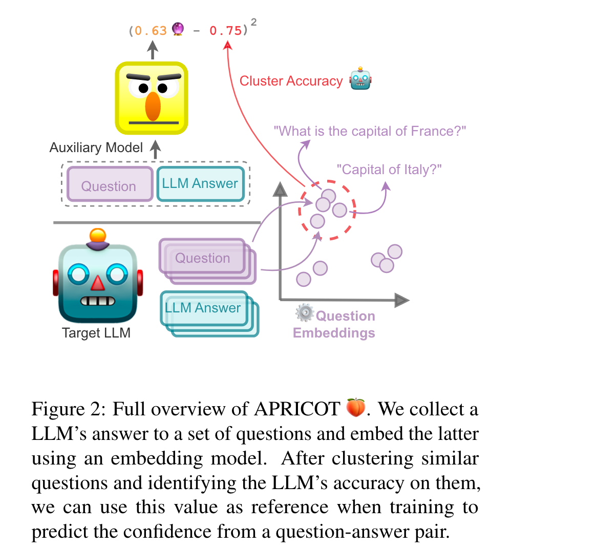
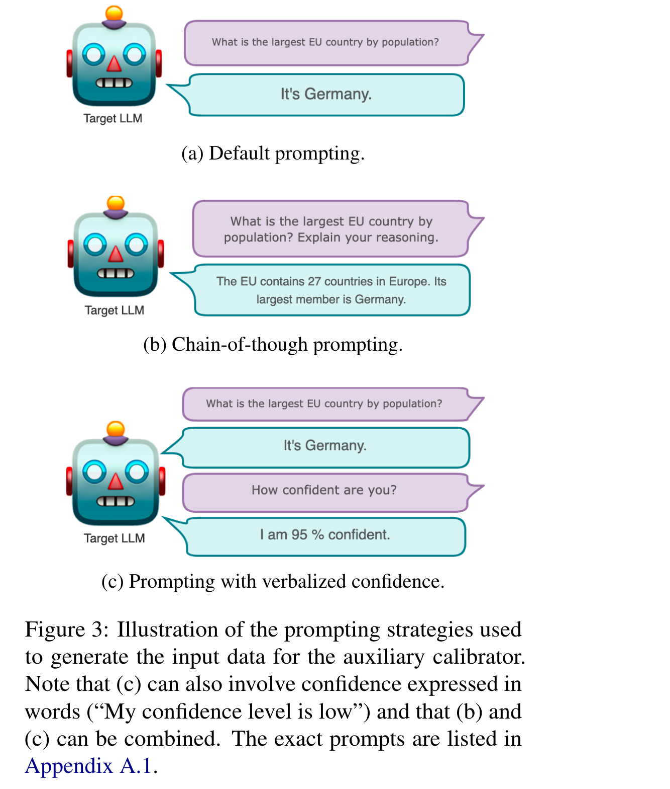

# Calibrating Large Language Models Using Their Generations Only

[[Link](https://arxiv.org/abs/2403.05973)]

## Motivation

- Finding effective ways to calibrate LLMsespecially when **the only interface to the models is their generated text**—remains a challenge.

## Methodology

A method called APRICOT to set confidence targets and train an additional model that predicts an LLM’s confidence based on its textual input and output alone. The model is trained by using these two parts as input and predicting calibration targets. The latter are obtained without access to the LLM’s sequence likelihoods or internal states by clustering input representations produced by an additional embedding model, and thus only require black-box access.

### APRICOT (Auxiliary Prediction of Confidence Targets)

1. Prompt the target LLM to generate training data for our auxiliary model. 
2. Set calibration targets in a way that does not require access to the target LLM beyond its generated outputs.
3. Train the auxiliary calibrator to predict the target LLM’s confidence for a given question. 
4. Contribute two parts: The creation of calibration targets and their prediction through the auxiliary model.

### Prompting the Target LLM

Generate finetuning data for the auxiliary model by prompting the target LLM on the given task.

### Setting Calibration Targets

1. Create clustered sets Cm of inputs with similar sentence embeddings. Calibration targets are then obtained by using the observed accuracy per set Cm.
   1. Embed questions into a latent space using a light-weight model such as SentenceBERT, normalize the embeddings along the feature dimension, and then use HDBSCAN to cluster them into questions of similar topic.

### Training the Auxiliary Model

1. Feed the questions alongside some incontext samples into target LLM.
2. Retain the generated answers and create a dataset that combines the question and the target model’s answers to train the auxiliary calibrator.

## Experiments

### Datasets

- TriviaQA, CoQA.

### Baselines

- Length-normalized sequence likelihoods.
- Platt scaling.
- Verbalized uncertainty.

### Models

- Vicuna v1.5, GPT-3.5.

### Metrics

- Brier.
- ECE. 
- smECE.
- AUROC

### Findings

1. The diversity in calibration targets indicates that we detect sets of questions on which the LLM’s accuracy varies—and that this variety should be reflected.
2. Verbalized uncertainties approaches usually do not emit a wide variety of confidence scores.
3. The calibrator at least partially learns to infer the difficulty of the LLM answering a question from the type of question alone.

