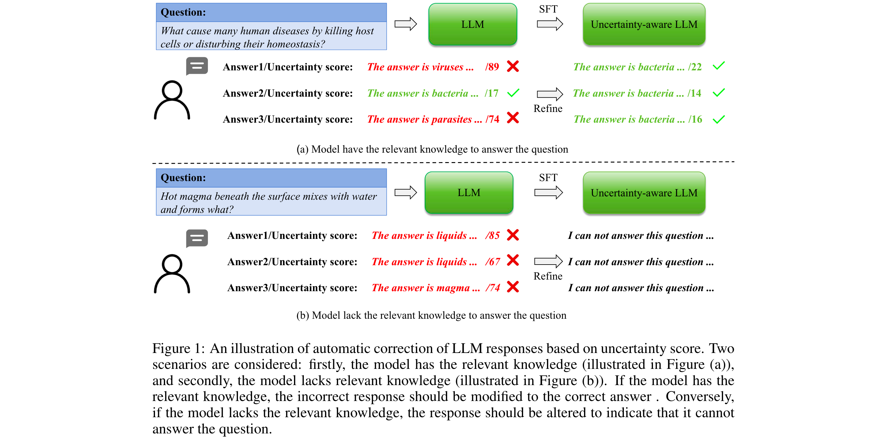
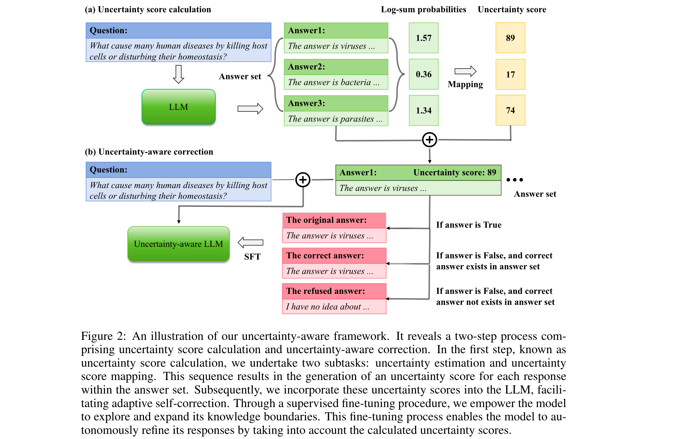
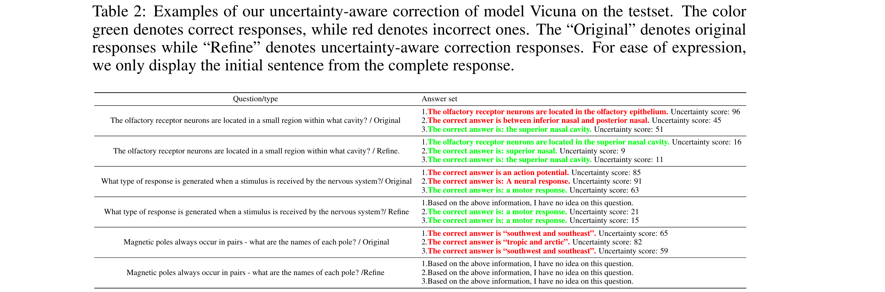

# Improving the Reliability of Large Language Models by Leveraging Uncertainty-Aware In-Context Learning
[[Link](https://arxiv.org/abs/2310.04782)]

## Motivation

- "Uncertainty is lower when the model’s response is correct compared to when it is incorrect.” 
- Setting a strict uncertainty threshold to discern the correctness of the model’s response seems intuitive, but it presents a formidable challenge in practice.

## Method

1. For each question in the calibration dataset, the model generates multiple responses, each labeled as “correct” or “incorrect”, with corresponding uncertainty calculations. 
2. When all of the model’s responses for a particular question are classified as “incorrect”, the uncertainty-aware model should refrain from providing an answer. 
3. Conversely, if at least one of the model’s responses aligns with the correct answer, the uncertainty-aware model should select the correct response as its final answer.

### Overview

- The uncertainty-aware framework is divided into two steps, namely **uncertainty score calculation** and **uncertainty-aware correction**.
  1. Utilize the logit output values of the model’s response to obtain the uncertainty of each generated token.
  2. Aggregate these token-level uncertainties to derive the uncertainty of each generated output.
- To explore the knowledge boundary of the model and investigate the beam search space within the answer set, make the model responds to the same question multiple times.
- After obtaining the uncertainty score for each response, we supervised fine-tuning the model for self-correction. This fine-tuning process empowers the model to autonomously adjust its responses based on the calculated uncertainty scores.

#### Uncertainty Score Calculation

**Uncertainty Score Estimation Method**

- Single-inference Based Uncertainty Estimation.
  - Minimum of Token Probabilities.
  - Average of Token Probabilities.
  - Normalized Product of Token Probabilities.
  - Log-sum of Token Probabilities.
- Multi-inference Based Uncertainty Estimation. (Not adapt)

**Uncertainty Score Mapping**

- Due to the highly **uneven** distribution of uncertainty in the training dataset, the direct inclusion of uncertainty introduces a great deal of noise and confusion.
- In the experiment, we investigate the impact of various classification granularities, namely deciles, hundreds, and thousands, which correspond to uncertainty scores ranging from 1 to 10, 1 to 100, and 1 to 1000, respectively.
- This same mapping strategy is applied during the inference stage, with uncertainty scores computed based on the intervals established during the training phase.

#### Uncertainty-Aware Correction

**Uncertainty-Aware Fine-tuning**

- Rather than directly injecting correct answers from the calibration dataset into the model, we employ it to assess the correctness of the model’s responses.
- In cases where all of the model’s responses for a particular question are categorized as “incorrect,” we interpret this as an indication that the model lacks the requisite knowledge to respond to the question
- When at least one of the model’s responses aligns with the correct answer, we infer that the model possesses the requisite knowledge to address the question.

**Test-time Correction**

- The model respond to each question once and calculate its corresponding uncertainty score. 
- Then resend the problem, the response and the uncertainty score to the model for **self-correction**.

## Experiment

### Tow Proposed Metrics

- Accuracy (“refused questions” and “answered questions.”)
- AUROC.

### Datasets

- SciQ.

### Models

- Vicuna and LLaMA.

### Findings

- Analysis of different uncertainty estimation methods - Log-sum is optimal.
- Analysis of mean uncertainty score and AUROC - Underscores the presence of a correlation between the mean uncertainty of responses and overall accuracy.

### Case Study

1. The uncertainty scores associated with correct responses do not consistently fall below those of incorrect responses.
2. During testing, responses with high uncertainty scores may be rejected, even if the model has the necessary knowledge to generate an answer to **improve reliability**.
3. The model consistently modifies its behavior to reject responses when it encounters questions that fall beyond its knowledge domain.

## Discussion

- Is there any better uncertainty estimation methods?
- **How to deal with over-confidence problem?**: The model’s resilience to variations in question content may serve as a potential indicator to judge whether a given response is a over-confidence question or not.
- Data uncertainty and model uncertainty: Unknown questions contribute to data uncertainty.

