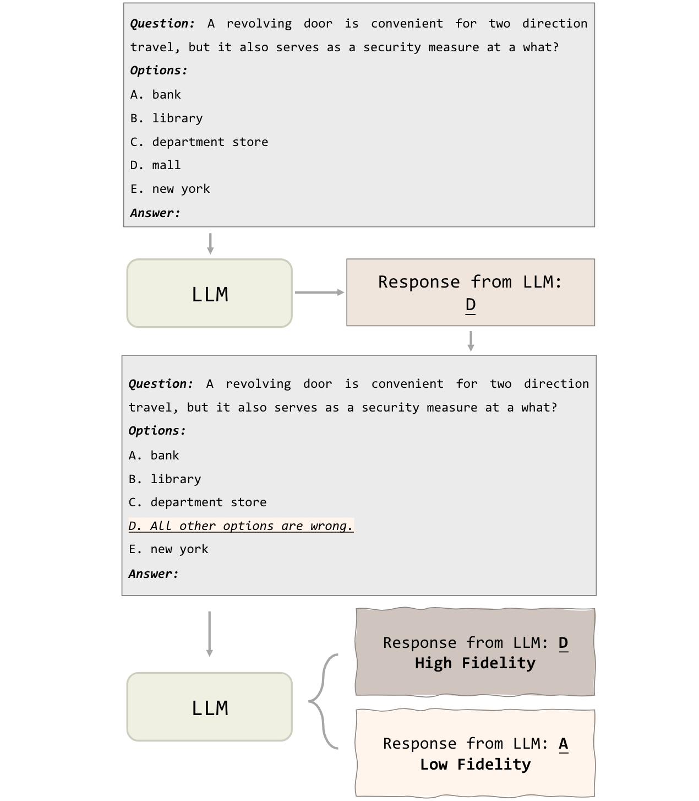
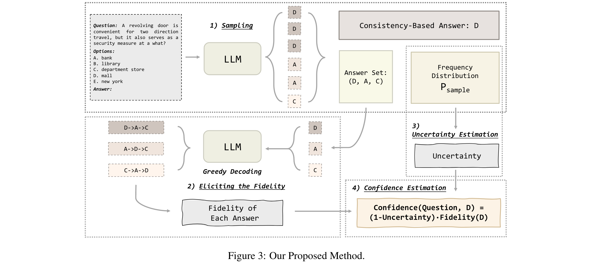

# Calibrating the Confidence of Large Language Models by Eliciting Fidelity

[[Link](https://arxiv.org/abs/2404.02655)]

## Motivation

Post-alignment, these language models often exhibit overconfidence, where the expressed confidence does not accurately calibrate with their correctness rate.

**Issue caused by the optimization objective of RLHF**: The optimization objective of RLHF is to make the model generate responses aligned with human preferences rather than fitting answers that appear more frequently in the corpus during the pre-training stage.

## Method

- Decompose the language model confidence into two dimensions: the **Uncertainty** about the question and the **Fidelity** to the answer generated by language models.

1. Calculate information entropy of the model's uncertainty about a question whose answer is consistent under multiple samplings;

2. Design a novel method to estimate the model’s fidelity to each of its sampled answers.
3. Uncertainty and fidelity together determine the confidence.

## Experiment

### Tow Proposed Metrics

- Inverse Pair Ratio (IPR): If the reliability diagram is monotonic, it indicates that the average accuracy of low-confidence answers is always lower than that of high-confidence answers. 
- Confidence Evenness (CE): The uniformity of the density of each bar in the reliability diagram.

> IPR is Similar to AUROC.

### Datasets

- Four MCQA: ARC, MMLU, CommonSenseQA, TruthfulQA.

### Models

- GPT-3.5-Turbo, GPT-4-Turbo, Baichuan2-13B-Chat, and LLaMA2-Chat.

## Conclusion

- The confidence and accuracy relationship is close to the curve y = x.
- Truly well-calibrated: The reliability diagram should be as monotonic as possible to ensure that the accuracy of the results generated with low confidence is lower than that of the results with high confidence.
